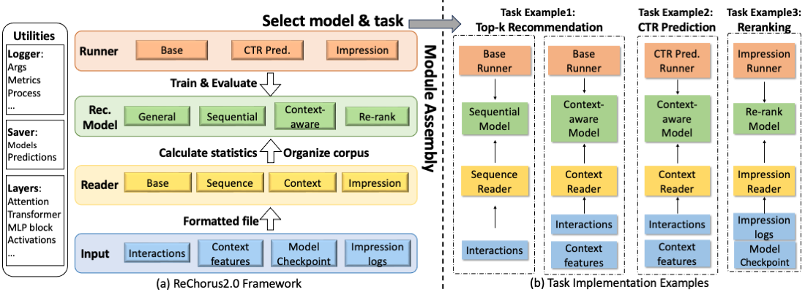

---

 
[](./LICENSE)
 
[](https://arxiv.org/abs/2405.18058)


ReChorus2.0 is a modular and task-flexible PyTorch library for recommendation, especially for research purpose. It aims to provide researchers a flexible framework to implement various recommendation tasks, compare different algorithms, and adapt to diverse and highly-customized data inputs. We hope ReChorus2.0 can serve as a more convinient and user-friendly tool for researchers, so as to form a "Chorus" of recommendation tasks and algorithms.

The previous version of ReChorus can be found at [ReChorus1.0](https://github.com/THUwangcy/ReChorus/tree/ReChorus1.0)

## What's New in ReChorus2.0:

- **New Tasks**: Newly supporting the context-aware top-k recommendation and CTR prediction task. Newly supporting the Impression-based re-ranking task.
- **New Models**: Adding Context-aware Recommenders and Impression-based Re-ranking Models. Listed below.
- **New dataset format**: Supporting various contextual feature input. Customizing candidate item lists in training and evaluation. Supporting variable length positive and negative samples.
- **Task Flexible**: Each model can serve for different tasks, and task switching is conveniently achieved by altering *model mode*.
  

This framework is especially suitable for researchers to choose or implement desired experimental settings, and compare algorithms under the same setting. The characteristics of our framework can be summarized as follows:

- **Modular**: primary functions modularized into distinct components: runner, model, and reader, facilitating code comprehension and integration of new features.
  
- **Swift**: concentrate on your model design ***in a single file*** and implement new models quickly.

- **Efficient**: multi-thread batch preparation, special implementations for the evaluation, and around 90% GPU utilization during training for deep models.

- **Flexible**: implement new readers or runners for different datasets and experimental settings, and each model can be assigned with specific helpers.

## Structure

Generally, ReChorus decomposes the whole process into three modules:

- [Reader](https://github.com/THUwangcy/ReChorus/tree/master/src/helpers/BaseReader.py): read dataset into DataFrame and append necessary information to each instance
- [Runner](https://github.com/THUwangcy/ReChorus/tree/master/src/helpers/BaseRunner.py): control the training process and model evaluation, including evaluation metrics.
- [Model](https://github.com/THUwangcy/ReChorus/tree/master/src/models/BaseModel.py): define how to generate output (predicted labels or ranking scores) and prepare batches.



## Requirements & Getting Started
See in the doc for [Requirements & Getting Started](https://github.com/THUwangcy/ReChorus/tree/master/docs/Getting_Started.md).

## Tasks & Settings

The tasks & settings are listed below

<table>
<tr><th> Tasks </th><th> Runner </th><th> Metrics </th><th> Loss Functions</th><th> Reader </th><th> BaseModel </th><th> Models</th><th> Model Modes </th></tr>
<tr><td rowspan="3"> Top-k Recommendation </td><td rowspan="3"> BaseRunner </td><td rowspan="3"> HitRate NDCG </td><td rowspan="3"> BPR </td><td> BaseReader </td><td> BaseModel.GeneralModel </td><td> general </td><td> '' </td></tr>
<tr><td> SeqReader </td><td> BaseModel.SequentialModel </td><td> sequential </td><td> '' </td></tr>
<tr><td> ContextReader </td><td> BaseContextModel.ContextModel </td><td> context </td><td> 'TopK' </td></tr>
<tr><td> CTR Prediction </td><td> CTRRunner </td><td> AUC Logloss </td><td> BPR, BCE </td><td> ContextReader </td><td> BaseContextModel.ContextCTRModel </td><td> context </td><td> 'CTR' </td></tr>
<tr><td rowspan="4"> Impression-based Ranking </td><td rowspan="4"> ImpressionRunner </td><td rowspan="4"> HitRate NDCG MAP </td><td rowspan="4"> List-level BPR, Listnet loss, Softmax cross entropy loss, Attention rank </td><td> ImpressionReader </td><td> BaseImpressionModel.ImpressionModel </td><td> general </td><td> 'Impression' </td></tr>
<tr><td> ImpressionSeqReader </td><td> BaseImpressionModel.ImpressionSeqModel </td><td> sequential </td><td> 'Impression' </td></tr>
<tr><td> ImpressionReader </td><td> BaseRerankerModel.RerankModel </td><td> reranker </td><td> 'General' </td></tr>
<tr><td> ImpressionSeqReader </td><td> BaseRerankerModel.RerankSeqModel </td><td> reranker </td><td> 'Sequential' </td></tr>
</table>


## Arguments
See in the doc for [Main Arguments](https://github.com/THUwangcy/ReChorus/tree/master/docs/Main_Arguments.md).

## Models
See in the doc for [Supported Models](https://github.com/THUwangcy/ReChorus/tree/master/docs/Supported_Models.md).

Experimental results and corresponding configurations are shown in [Demo Script Results](https://github.com/THUwangcy/ReChorus/tree/master/docs/demo_scripts_results/README.md).


## Citation

**If you find ReChorus is helpful to your research, please cite either of the following papers. Thanks!**

```
@article{li2024rechorus2,
  title={ReChorus2. 0: A Modular and Task-Flexible Recommendation Library},
  author={Li, Jiayu and Li, Hanyu and He, Zhiyu and Ma, Weizhi and Sun, Peijie and Zhang, Min and Ma, Shaoping},
  journal={arXiv preprint arXiv:2405.18058},
  year={2024}
}

@inproceedings{wang2020make,
  title={Make it a chorus: knowledge-and time-aware item modeling for sequential recommendation},
  author={Wang, Chenyang and Zhang, Min and Ma, Weizhi and Liu, Yiqun and Ma, Shaoping},
  booktitle={Proceedings of the 43rd International ACM SIGIR Conference on Research and Development in Information Retrieval},
  pages={109--118},
  year={2020}
}
@article{王晨阳2021rechorus,
  title={ReChorus: 一个综合, 高效, 易扩展的轻量级推荐算法框架},
  author={王晨阳 and 任一 and 马为之 and 张敏 and 刘奕群 and 马少平},
  journal={软件学报},
  volume={33},
  number={4},
  pages={0--0},
  year={2021}
}
```

This is also our public implementation for the following papers (codes and datasets to reproduce the results can be found at corresponding branch):


- *Chenyang Wang, Min Zhang, Weizhi Ma, Yiqun Liu, and Shaoping Ma. [Make It a Chorus: Knowledge- and Time-aware Item Modeling for Sequential Recommendation](http://www.thuir.cn/group/~mzhang/publications/SIGIR2020Wangcy.pdf). In SIGIR'20.*

```bash
git clone -b SIGIR20 https://github.com/THUwangcy/ReChorus.git
```

- *Chenyang Wang, Weizhi Ma, Min Zhang, Chong Chen, Yiqun Liu, and Shaoping Ma. [Towards Dynamic User Intention: Temporal Evolutionary Effects of Item Relations in Sequential Recommendation](https://chenchongthu.github.io/files/TOIS-KDA-wcy.pdf). In TOIS'21.*

```bash
git clone -b TOIS21 https://github.com/THUwangcy/ReChorus.git
```

- *Chenyang Wang, Weizhi Ma, Chong, Chen, Min Zhang, Yiqun Liu, and Shaoping Ma. [Sequential Recommendation with Multiple Contrast Signals](https://dl.acm.org/doi/pdf/10.1145/3522673). In TOIS'22.*

```bash
git clone -b TOIS22 https://github.com/THUwangcy/ReChorus.git
```

- *Chenyang Wang, Zhefan Wang, Yankai Liu, Yang Ge, Weizhi Ma, Min Zhang, Yiqun Liu, Junlan Feng, Chao Deng, and Shaoping Ma. [Target Interest Distillation for Multi-Interest Recommendation](). In CIKM'22.*

```bash
git clone -b CIKM22 https://github.com/THUwangcy/ReChorus.git
```

## Contact

**ReChorus 1.0**: Chenyang Wang (THUwangcy@gmail.com)

**ReChorus 2.0**: Jiayu Li (lijiayu997@gmail.com), Hanyu Li (l-hy12@outlook.com)

<!-- MARKDOWN LINKS & IMAGES -->

<!-- https://www.markdownguide.org/basic-syntax/#reference-style-links -->

[contributors-shield]: https://img.shields.io/github/contributors/othneildrew/Best-README-Template.svg?style=flat-square
[contributors-url]: https://github.com/othneildrew/Best-README-Template/graphs/contributors
[forks-shield]: https://img.shields.io/github/forks/othneildrew/Best-README-Template.svg?style=flat-square
[forks-url]: https://github.com/othneildrew/Best-README-Template/network/members
[stars-shield]: https://img.shields.io/github/stars/othneildrew/Best-README-Template.svg?style=flat-square
[stars-url]: https://github.com/othneildrew/Best-README-Template/stargazers
[issues-shield]: https://img.shields.io/github/issues/othneildrew/Best-README-Template.svg?style=flat-square
[issues-url]: https://github.com/othneildrew/Best-README-Template/issues
[license-shield]: https://img.shields.io/github/license/othneildrew/Best-README-Template.svg?style=flat-square
[license-url]: https://github.com/othneildrew/Best-README-Template/blob/master/LICENSE.txt
[linkedin-shield]: https://img.shields.io/badge/-LinkedIn-black.svg?style=flat-square&logo=linkedin&colorB=555
[linkedin-url]: https://linkedin.com/in/othneildrew
[product-screenshot]: images/screenshot.png
